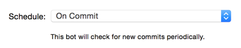

# [fit] Tooling<br />in<br />**Swift** 

^ Greeting!

^ Today I'm up here to share about Tooling in Swift.

---

# [fit] I'm Stan!
## A.K.A **lx**cid

^ I'm Stan!

^ Also known as lxcid.

^ *My project usually begin with LX.

---

> What you do today can be **automated** tomorrow
-- Douglas Mcllroy

^ Start of with this quote.

^ As a programmer, it is your job to put yourself out of business.

---

# [fit] **Automate**

^ There's mainly 4 types of automation I would like to talk about.

---

# [fit] **Automate**
## Transformation

^ Data: To and fro machine readable to human readable format

^ Enable scalability

---

# [fit] **Automate**
## Abstraction

^ Programming Paradigm

^ Ever evolving: From C (functional) to Objective-C (object-oriented) to Swift (protocol-oriented)

^ Increase our contextual bandwidth

^ How much we can understand or describe

---

# [fit] **Automate**
## Flow

^ Natural flow of events

^ Visualize as (directed) graphs

^ Restrict our choices

^ Build automation

^ Dependency management system

---

# [fit] **Automate**
### Error Detection/Prevention

^ Useful in highly error prone environment like Collaboration

^ Can't merge without resolving conflicts

^ Continuous integration

^ Tests

^ Gave us confidence

---

# [fit] *Automate*
## Build

---

# Build

- *On-demand*
Makefile
nomad/shenzhen
fabric/fastlane
custom scripts

^ Most tools are ruby backed.
^ [nomad/shenzhen](https://github.com/nomad/shenzhen)
^ [fabric/fastlane](https://fastlane.tools) recently got acquired by Twitter, part of Fabric.

---
# Build

- **Scheduled/Triggered**
Xcode Server
Travis CI
Circle CI (beta)

---
# Build

- **Scheduled/Triggered**
☞ Xcode Server ☜
Travis CI
Circle CI (beta)

^ Focus on Xcode Server 

---


# OS X Server <br /> *19.99 USD*

---


---


---


---



---


---


---


[rnystrom/HackerNewsReader](https://github.com/rnystrom/HackerNewsReader)

**Demo**

^ We attempt to set up continuous integration for HackerNewsReader.

---


---

# Integration Error

```
Error: /../Podfile.lock: No such file or directory
Error: /Manifest.lock: No such file or directory
Error: The sandbox is not in sync with the Podfile.lock.
Run 'pod install' or update your CocoaPods installation.
```

---

# [fit] Cocoapods
#### **automate dependency management**

---

# Run

```bash
sudo gem install cocoapods
```

---

# Pre-Trigger

```bash
pod install
```

---


---

# **Without** <br /> ~~`sudo`~~ <br /> **?**

---


^ Integration are run under the user `_xcsbuildd` (likely acronym for Xcode Server Build Daemon).
^ We needs set up cocoapods in user space.
^ /bin/false -> /bin/bash

---

# Pre-Trigger

```bash
#!/bin/sh
export WORKING_DIR="HackerNewsReader"
# Cocoapods require us to define the language
export LANG=en_US.UTF-8
# Add user space bin directory of rubygem in $PATH
if which ruby >/dev/null && which gem >/dev/null; then
	PATH="$(ruby -rubygems -e 'puts Gem.user_dir')/bin:$PATH"
fi
# Install cocoapods in user space of rubygem
gem install --user-install cocoapods
cd $WORKING_DIR
pod install
```

---

^ Show Xcode Web: https://khinboon.local/xcode

# DEMO

^ [After Demo]
^ We gotten the project set up for continuous integration.
^ Periodically, the CI will detect new commits and spawn an integration.
 
---

# Nightly Build

---

# Nightly Build

☐ Versioning

☑︎ **Integration**

☐ Commit & Tag

☐ Distribute

---

# [fit] *Automate*
## Versioning

^ Mostly incremental

---

# Versioning
- **Apple Generic Versioning**

---

# [fit] agvtool
### **Apple Generic Versioning**

---

## **Apple Generic Versioning**

- Version (Marketing)
*CFBundleShortVersionString*
- Build (Internal)
*CFBundleVersion*

---

 

---

## **Apple Generic Versioning** Xcode

- 7.1
*CFBundleShortVersionString*
- 9079
*CFBundleVersion*
- 7B91b
*ProductBuildVersion*

---


---

## **Apple Generic Versioning** Map

- 2.0
*CFBundleShortVersionString*
- 1844.0.15
*CFBundleVersion*

---


---

## **Apple Generic Versioning** OS X Server

- 5.0.15
*CFBundleShortVersionString*
- 662
*CFBundleVersion*
- 15S4033
*ProductBuildVersion*

---

## Cons of **Apple Generic Versioning**

- No specification/No version graph
- Inconsistent
- Not expressive
- No git support
- No versioning for Version (Marketing)
- **Limited versioning for Build (Internal)**

---

# Limited versioning for Build (Internal)
#### **agvtool next-version | bump**

⭕️ 1844.0.15 ➤ 1845

❌ 1844.0.15 ➤ 1844.1

❌ 1844.0.15 ➤ 1844.0.16

---

# Versioning
- ~~*Apple Generic Versioning*~~
- **Semantic Versioning 2.0.0**

---

# [fit] Major.Minor.Patch-Prerelease(DSV)+Metadata(DSV)
#### **DSV =Dot Separated Values**

---


---

# [fit] **LXSemVer.framework**
### [lxcid/LXSemVer](https://github.com/lxcid/LXSemVer)

^ Carthage: Share your project scheme.
^ Cocoapods-Rome: Create a podspec.

---

# Scripting CLI

*Podfile*

```Ruby
plugin 'cocoapods-rome'
pod 'LXSemVer', '~> 1.0'
```

*semver*

```Bash
#!/usr/bin/env xcrun swift -F Rome
```

---

# DEMO

---

# Scripting Nightly Triggers

- Prerelease is always tagged with **nightly**
- Retrieve project's versions from its Info.plist
- Keep a nightly counter in its Info.plist
**LXNightlyBuildVersionString**

---

# [fit] **LXXcodeTools.framework**
### [lxcid/LXXcodeTools](https://github.com/lxcid/LXXcodeTools)

---

# **LXXcodeTools.framework**

- Spawn new process with **NSTask**
- Parses the output of Xcodebuild
**#/usr/bin/xcrun xcodebuild -showBuildSettings**

# DEMO

---

# [fit] **DevToolsCore.framework**
#### /Applications/Xcode.app/Contents/PlugIns/Xcode3Core.ideplugin/Contents/Frameworks/DevToolsCore.framework

---

# **DevToolsCore.framework**

- Private framework
- Generate our own headers
- Import the framework into Swift by
defining a module with modulemap

---

# **DevToolsCore.framework**
#### Generating headers

 - *class-dump*
 - *Partially declared headers is fine*

---

# **DevToolsCore.framework**
#### Defining modulemap

*Create umbrella header*

```C
#import <DevToolsCore/PBXObject.h>
#import <DevToolsCore/PBXProject.h>
#import <DevToolsCore/PBXProjectItem.h>
#import <DevToolsCore/PBXTarget.h>
```

*Create modulemap*

```C
module DevToolsCore {
	umbrella header "DevToolsCore.h"
	link framework "DevToolsCore"
}
```

---

# **DevToolsCore.framework**
#### Resolve framework dependencies

```Bash
$ otool -L /path/to/DevToolsCore.framework/DevToolsCore
	@rpath/DVTFoundation.framework/Versions/A/DVTFoundation
	@rpath/IDEFoundation.framework/Versions/A/IDEFoundation
	@rpath/DevToolsFoundation.framework/Versions/A/DevToolsFoundation
	@rpath/DevToolsSupport.framework/Versions/A/DevToolsSupport
 
```

---

# **DevToolsCore.framework**
#### Import the modularized Framework

```Swift
#!/usr/bin/env xcrun swift
	-F Rome
	-I modules
	-F /Applications/Xcode.app/Contents/SharedFrameworks
	-F /Applications/Xcode.app/Contents/Frameworks
	-F /Applications/Xcode.app/Contents/PlugIns/Xcode3Core.ideplugin/Contents/Frameworks
	-framework DVTSourceControl
	-framework IDEFoundation
	-framework DevToolsFoundation
	-framework DevToolsSupport
	-framework DVTFoundation
	-framework IBFoundation
	-framework IBAutolayoutFoundation

…

import DevToolsCore
```

---

# DEMO

---

## Cons of **Semantic Versioning**

- Can't submit to iTunes

---

# Nightly Build

☑ **Versioning**

☑︎ **Integration**

☐ Commit & Tag

☐ Distribute

---

# Commit & Tag

```Bash
/usr/bin/git commit --all --message="$VERSION"
/usr/bin/git tag $VERSION
/usr/bin/git push --set-upstream
/usr/bin/git push --tags
```

---

# Distribute

```Bash
# http://stackoverflow.com/a/32784145
originalBinaryName=$(basename "${XCS_ARCHIVE%.*}".ipa)
originalBinaryPath="${XCS_OUTPUT_DIR}/ExportedProduct/Apps/${originalBinaryName}"

xcodebuild -exportArchive -exportFormat IPA \
	-exportProvisioningProfile my_profile_name \
	-archivePath $XCS_ARCHIVE \
	-exportPath /path/to/AppName.ipa \

# Check with your distribution provider on the CLI to distribute the app. 
```

---

# Nightly Build

☑ **Versioning**

☑︎ **Integration**

☑︎ **Commit & Tag**

☑︎ **Distribute**

---

# [fit] *Automate*
## Code Generation

^ Example: mogenerator

---

 

---

# Xcode Server

- Xcode Server is written in Node
**/Applications/Xcode.app/Contents/Developer/usr/share/xcs/xcsd**
- [Xcode Server API](https://developer.apple.com/library/watchos/documentation/Xcode/Conceptual/XcodeServerAPIReference/index.html)

---


^ https://xkcd.com/1319/

---


---

# Questions?

---
