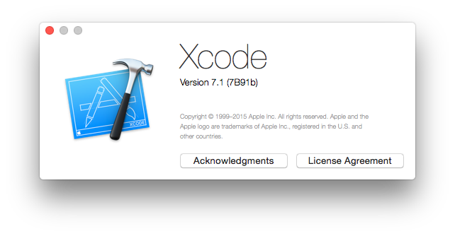

# [fit] Tooling in **Swift** 

^ Greeting!

^ Today I'm up here to share about Tooling in Swift.

---

# [fit] I'm Stan!
## A.K.A **lx**cid

^ I'm Stan!

^ Also known as lxcid.

^ *My project usually begin with LX.

---

> What you do today can be **automated** tomorrow
-- Douglas Mcllroy

^ Start of with this quote.

^ As a programmer, it is your job to put yourself out of business.

---

# [fit] **Automate**

^ There's mainly 4 types of automation I would like to talk about.

---

# [fit] **Automate**
## Transformation

^ Data: To and fro machine readable to human readable format

^ Enable scalability

---

# [fit] **Automate**
## Abstraction

^ Programming Paradigm

^ Ever evolving: From C (functional) to Objective-C (object-oriented) to Swift (protocol-oriented)

^ Increase our contextual bandwidth

^ How much we can understand or describe

---

# [fit] **Automate**
## Flow

^ Natural flow of events

^ Visualize as (directed) graphs

^ Restrict our choices

^ Build automation

^ Dependency management system

---

# [fit] **Automate**
### Error Detection/Prevention

^ Useful in highly error prone environment like Collaboration

^ Can't merge without resolving conflicts

^ Continuous integration

^ Tests

^ Gave us confidence

---

# [fit] *Automate*
## Build

---

# OS X Server   *19.99 USD*

^ TODO: Change to OS X Server image.

---

# [fit] *Automate*
## Versioning

---

# Versioning
- **Apple Generic Versioning**

---

# [fit] agvtool
### **Apple Generic Versioning**

---

## **Apple Generic Versioning**

- Version (Marketing)
*CFBundleShortVersionString*
- Build (Internal)
*CFBundleVersion*

---

 

---

## **Apple Generic Versioning** Xcode

- 7.1
*CFBundleShortVersionString*
- 9079
*CFBundleVersion*
- 7B91b
*ProductBuildVersion*
- 9079000000000000
*SourceVersion*

---

## Cons of **Apple Generic Versioning**

- No specification
- Not expressive
- Build (Internal) have Weak Flow

---

# Versioning
- ~~*Apple Generic Versioning*~~
- **Semantic Versioning 2.0.0**

---

NSTask

---

# [fit] *Automate*
## Code Generation

^ Example: mogenerator

---

Automating your development process with Swift

---

# Agenda

- When is swift the right tool for the right job?
 - Hook into your build processes:
  - Development process
  - Continuous integration process
  	- Beta/App Store Release
- Xcode Plugin

---

No matter what, our grand master is Xcode.

---

# Tools I loved

- mogenerator (objective-c)
- cocoapods (ruby)
- catherage (swift)

---

# Custom Tools

- Generates enum/extension from asset catalog.
- Alert slack of integration result.
- Automating versioning versioning.
- mogenerator.

---

# Automating versioning

---

## Existing tool

- agvtool

---

# Automating versioning
## Version Bump

- 2 type of version:
 - Version (CFBundleShortVersionString): Marketing
 - Build (CFBundleVersion): Internal

## Apple Answer

 - Technical Q&A QA1827

- agvtool
 - Current Project Version (CURRENT_PROJECT_VERSION): Integer or floating point number
 - Versioning System (VERSIONING_SYSTEM): None or Apple Generic

---

## Why it suck

- No specification of Apple Genric versioning. (man agvtool)
- No auto figuring out of next marketing version.
- No controling of next version granularity.
- No GIT support (CSV and SVN only) 

---

## TestFlight

- Waiting for beta review is a **DUMB** idea
- No support for semver

---

## When to use agvtool

- If you follows the Apple Generic versioning (Whatever it might be)
- You are an Apple employee
- If you like to populate your project with more settings.

---

## Write your own!

- Semantic Versioning 2 (At least it has a specification)
- Find Xcode Project
- Bump version

[Graph showing the possible path from current version to next] 

---

## #!/usr/bin/swift
### Scripting in Swift

---

## Continuous Integration

- Triggers
- Xcode Server API

## http://www.robertvojta.com/2015/06/30/swift-hidden-options/

## google search: swift module map

---

https://xkcd.com/1319/

^ Incomplete without an xkcd reference

---

---

## Worth it?

^ Might not be worth it.

---
